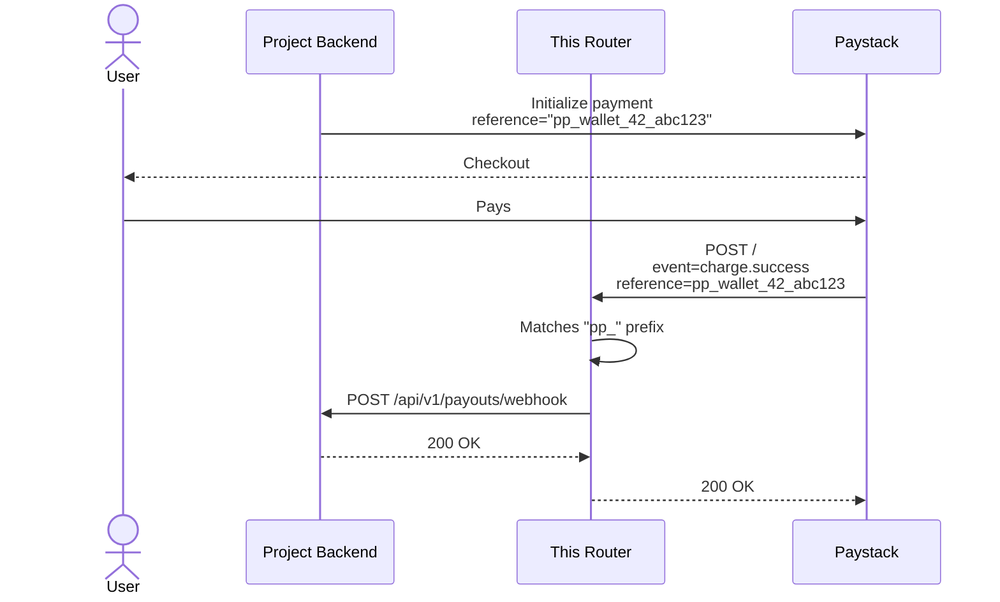

# Paystack Webhook Router

One Paystack webhook URL → all your projects.

## Why

Paystack allows **one webhook URL per account**. If you run multiple apps (PagePay, salon system, tutoring platform, etc.), they all need to receive payment events. This router sits in the middle and forwards each event to the correct project backend based on the payment `reference` prefix.

## How it works



## Setup

### 1. Add your projects

Edit `src/index.ts` and add each project to the `ROUTES` array:

```ts
const ROUTES: { prefix: string; url: string }[] = [
  {
    prefix: "pp_",
    url: "https://pagepay-fff6.onrender.com/api/v1/payouts/webhook",
  },
  {
    prefix: "salon_",
    url: "https://salon-api.yourapp.com/webhooks/paystack",
  },
];
```

### 2. Update each project to use a unique reference prefix

Every project that creates Paystack transactions must use its own prefix:

```python
# PagePay — uses "pp_"
reference = f"pp_wallet_{user_id}_{uuid.uuid4().hex[:12]}"
reference = f"pp_sub_{user_id}_{uuid.uuid4().hex[:12]}"

# Salon app — uses "salon_"
reference = f"salon_{booking_id}_{uuid.uuid4().hex[:12]}"

# Tutor app — uses "tutor_"
reference = f"tutor_{student_id}_{uuid.uuid4().hex[:12]}"
```

The rest of each project's webhook logic stays exactly the same.

### 3. Deploy

```bash
# Install
npm install

# Run locally for testing
npm run dev

# Deploy to Cloudflare Workers
npm run deploy
```

### 4. Set the Paystack secret key as a secret

```bash
wrangler secret put PAYSTACK_SECRET_KEY
# Paste your Paystack secret key when prompted
```

### 5. Paste the router URL into Paystack dashboard

After deploy, your URL will be something like:

```
https://paystack-webhook-router.yourname.workers.dev
```

Set this as the **single webhook URL** in Paystack → Settings → Webhooks.

## Platform

**Cloudflare Workers** — free tier, no cold starts, edge network.

- 100,000 free requests/day
- No credit card required
- Deploy with one command: `npm run deploy`

Alternative: **Vercel Serverless Functions** or **Railway** if you prefer. The code is framework-agnostic.

## Environment variables

| Variable | Required | Description |
|----------|----------|-------------|
| `PAYSTACK_SECRET_KEY` | Yes | Your Paystack secret key (`sk_live_...` or `sk_test_...`) |

Set secrets with `wrangler secret put` or in the Cloudflare dashboard.

## Routing logic

1. Verify `X-Paystack-Signature` using `PAYSTACK_SECRET_KEY`
2. Parse event JSON
3. Extract `data.reference`
4. Find the first `ROUTES` entry whose `prefix` matches the start of the reference
5. Forward the raw body + signature to that project's webhook URL
6. Return the project's response back to Paystack

If no prefix matches, we log it and return 200 so Paystack doesn't retry forever.

## Security

- Signature verified before routing
- Raw body forwarded unchanged — project backends can verify again if they want
- No secrets logged
- Non-routable events return 200 to stop retries
